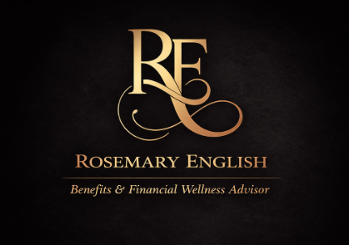

# rosemaryenglish
Rosemary English is a trusted advisor to discerning clients, specializing in employee benefits and financial wellness strategies designed to protect and preserve wealth. With a commitment to confidentiality and a focus on personalized service, she brings extensive experience and a tailored approach to each client's unique needs.
<!DOCTYPE html>
<html lang="en">
<head>
  <meta charset="UTF-8" />
  <meta name="viewport" content="width=device-width, initial-scale=1.0" />
  <title>Rosemary English | Benefits & Financial Wellness Advisor</title>
  <link rel="stylesheet" href="style.css" />
  <link href="https://fonts.googleapis.com/css2?family=Playfair+Display:wght@500;700&family=Montserrat:wght@300;400&display=swap" rel="stylesheet">
</head>
<body>

<header>
  <nav>
    <ul>
      <li><a href="#home">Home</a></li>
      <li><a href="#wellness">Wellness</a></li>
      <li><a href="#legal">Legal & Identity</a></li>
      <li><a href="#honeststok">HonestStok</a></li>
      <li><a href="#wealth">Wealth & Legacy</a></li>
      <li><a href="#contact">Contact</a></li>
    </ul>
  </nav>
</header>

<section id="home" class="hero">
  
  <h1>Rosemary English</h1>
  <h2>Benefits & Financial Wellness Advisor</h2>
</section>

<section class="about">
  <h3>About</h3>
  
  

    Rosemary English is a trusted advisor to discerning clients, specializing in benefits,
    financial wellness, and legacy-focused strategies designed to protect, preserve, and
    position wealth.
  

  

    With a commitment to confidentiality and a highly personalized approach, Rosemary works
    with individuals, families, and professionals to deliver thoughtful solutions aligned
    with long-term goals.
  

</section>

<section id="wellness">
  <h3>EHP Wellness Program</h3>
  

    The EHP Wellness Program provides proactive healthcare access focused on prevention,
    early detection, and personalized wellness oversight—outside the constraints of
    traditional insurance-based models.
  

</section>

<section id="legal">
  <h3>LegalShield & ID Shield</h3>
  

    Clients gain access to legal support and identity protection services designed to
    safeguard personal, family, and professional interests in an increasingly complex
    environment.
  

</section>

<section id="honeststok">
  <h3>HonestStok Technology Solutions</h3>
  

    HonestStok delivers independent technology strategy through access to 700–800 vetted
    technology providers, allowing organizations to compare solutions objectively and avoid
    vendor lock-in.
  

  

    Proof-of-concept evaluations are offered at no upfront cost—an approach that is virtually
    unheard of in the technology industry—enabling confident, cost-efficient decision making.
  

</section>

<section id="wealth">
  <h3>Wealth & Legacy Planning</h3>
  

    Rosemary partners with a broad network of highly rated carriers to deliver life insurance,
    annuities, and life settlement strategies designed around each client’s unique objectives,
    timeline, and legacy goals.
  

</section>

<section id="contact">
  <h3>Private Consultation</h3>
  

    For private inquiries or consultation requests, please contact:
  

  
rosemary@rosemaryenglish.com

</section>

<footer>
  

    Disclosure: Rosemary English is a Benefits & Financial Wellness Advisor. Services referenced
    on this website are provided through partnerships with third-party service providers and
    carriers. Availability, terms, and suitability vary by individual circumstances. This
    website is for informational purposes only and does not constitute legal, tax, or
    investment advice.
  

</footer>
body {
  margin: 0;
  background: #000;
  color: #e8d8b0;
  font-family: 'Montserrat', sans-serif;
  text-align: center;
}

nav ul {
  list-style: none;
  display: flex;
  justify-content: center;
  padding: 20px;
  gap: 30px;
}

nav a {
  color: #e8d8b0;
  text-decoration: none;
  font-size: 14px;
  letter-spacing: 1px;
}

.hero {
  padding: 80px 20px;
}

.logo {
  width: 140px;
  margin-bottom: 20px;
}

h1 {
  font-family: 'Playfair Display', serif;
  font-size: 42px;
  margin: 10px 0;
}

h2 {
  font-weight: 300;
  font-size: 18px;
}

section {
  padding: 80px 20px;
  max-width: 900px;
  margin: auto;
}

.headshot {
  width: 280px;
  border-radius: 6px;
  margin: 30px 0;
}

.email {
  font-size: 18px;
  letter-spacing: 1px;
}

footer {
  font-size: 12px;
  color: #999;
  padding: 40px;
}

</body>
</html>
